<!-- The cards below are generated by scripts/cards/build.py and refreshed daily by the workflow. -->

<a href="https://abhaymaurya.com"><picture><source media="(prefers-color-scheme: dark)" srcset="assets/cards/hero-dark.svg"></picture></a>

<a href="https://abhaymaurya.com"><picture><source media="(prefers-color-scheme: dark)" srcset="assets/cards/chip-portfolio-dark.svg"></picture></a><a href="https://www.linkedin.com/in/liquidatorcoder/"><picture><source media="(prefers-color-scheme: dark)" srcset="assets/cards/chip-linkedin-dark.svg"></picture></a><a href="https://x.com/LiquidatorAB_"><picture><source media="(prefers-color-scheme: dark)" srcset="assets/cards/chip-x-dark.svg"></picture></a><a href="https://abhaymaurya.com/contact"><picture><source media="(prefers-color-scheme: dark)" srcset="assets/cards/chip-contact-dark.svg"></picture></a>

<a href="https://github.com/Hash-Studios/Prism"><picture><source media="(prefers-color-scheme: dark)" srcset="assets/cards/stat-1-dark.svg"></picture></a><a href="https://github.com/Hash-Studios/Prism"><picture><source media="(prefers-color-scheme: dark)" srcset="assets/cards/stat-2-dark.svg"></picture></a><a href="https://github.com/LiquidatorCoder"><picture><source media="(prefers-color-scheme: dark)" srcset="assets/cards/stat-3-dark.svg"></picture></a><a href="#flutter-packages"><picture><source media="(prefers-color-scheme: dark)" srcset="assets/cards/stat-4-dark.svg"></picture></a>

## Products

<a href="https://edie.video"><picture><source media="(prefers-color-scheme: dark)" srcset="assets/cards/product-edie-dark.svg"></picture></a><a href="https://splitfast.app"><picture><source media="(prefers-color-scheme: dark)" srcset="assets/cards/product-splitfast-dark.svg"></picture></a>

<a href="https://fluttertune.com"><picture><source media="(prefers-color-scheme: dark)" srcset="assets/cards/product-fluttertune-dark.svg"></picture></a><a href="https://croomfs.com"><picture><source media="(prefers-color-scheme: dark)" srcset="assets/cards/product-croomfs-dark.svg"></picture></a><a href="https://turnitgenz.com"><picture><source media="(prefers-color-scheme: dark)" srcset="assets/cards/product-turnitgenz-dark.svg"></picture></a>

<a href="https://hashstudios.in"><picture><source media="(prefers-color-scheme: dark)" srcset="assets/cards/hashstudios-dark.svg"></picture></a>

## Flutter packages

<a href="https://pub.dev/packages/bubbles_sheet"><picture><source media="(prefers-color-scheme: dark)" srcset="assets/cards/pkg-bubbles_sheet-dark.svg"></picture></a><a href="https://pub.dev/packages/morph_route"><picture><source media="(prefers-color-scheme: dark)" srcset="assets/cards/pkg-morph_route-dark.svg"></picture></a><a href="https://pub.dev/packages/flywheel_carousel"><picture><source media="(prefers-color-scheme: dark)" srcset="assets/cards/pkg-flywheel_carousel-dark.svg">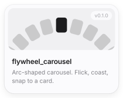</picture></a><a href="https://pub.dev/packages/flutter_mesh_transform"><picture><source media="(prefers-color-scheme: dark)" srcset="assets/cards/pkg-flutter_mesh_transform-dark.svg">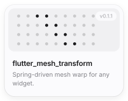</picture></a>

<a href="https://pub.dev/packages/arsenal"><picture><source media="(prefers-color-scheme: dark)" srcset="assets/cards/pkg-arsenal-dark.svg"></picture></a><a href="https://pub.dev/packages/flip_card_swiper"><picture><source media="(prefers-color-scheme: dark)" srcset="assets/cards/pkg-flip_card_swiper-dark.svg"></picture></a><a href="https://pub.dev/packages/flutter_debug_tools"><picture><source media="(prefers-color-scheme: dark)" srcset="assets/cards/pkg-flutter_debug_tools-dark.svg"></picture></a><a href="https://pub.dev/packages/better_textfield"><picture><source media="(prefers-color-scheme: dark)" srcset="assets/cards/pkg-better_textfield-dark.svg"></picture></a>

## Writing

<!-- BLOG-POST-LIST:START -->
- [Creating a smooth stacked cards animation in Flutter](https://liquidatorcoder.medium.com/creating-a-smooth-stacked-cards-animation-in-flutter-4c03db79ee68?source=rss-b46c583c10b2------2)
- [Building your first app in Flutter](https://liquidatorcoder.medium.com/building-your-first-app-in-flutter-ed10e971cc21?source=rss-b46c583c10b2------2)
- [Effective Skeleton Loader in Flutter](https://liquidatorcoder.medium.com/effective-skeleton-loader-in-flutter-b567e60d5314?source=rss-b46c583c10b2------2)
- [Making your first game in Kivy &amp; Python](https://medium.com/techspace-usict/making-your-first-game-in-kivy-python-91fcda83aa5c?source=rss-b46c583c10b2------2)
<!-- BLOG-POST-LIST:END -->

## Stats

<picture><source media="(prefers-color-scheme: dark)" srcset="https://github-readme-stats.vercel.app/api?username=LiquidatorCoder&show_icons=true&hide_border=true&border_radius=20&bg_color=18181c&title_color=f5f5f7&icon_color=f5f5f7&text_color=9a9aa3&ring_color=f5f5f7"></picture><picture><source media="(prefers-color-scheme: dark)" srcset="https://github-readme-stats.vercel.app/api/top-langs/?username=LiquidatorCoder&layout=compact&hide_border=true&border_radius=20&bg_color=18181c&title_color=f5f5f7&text_color=9a9aa3"></picture>

<picture><source media="(prefers-color-scheme: dark)" srcset="https://streak-stats.demolab.com/?user=LiquidatorCoder&hide_border=true&border_radius=20&background=18181c&ring=f5f5f7&fire=f5f5f7&currStreakNum=f5f5f7&sideNums=f5f5f7&currStreakLabel=f5f5f7&sideLabels=9a9aa3&dates=6e6e73"></picture>

